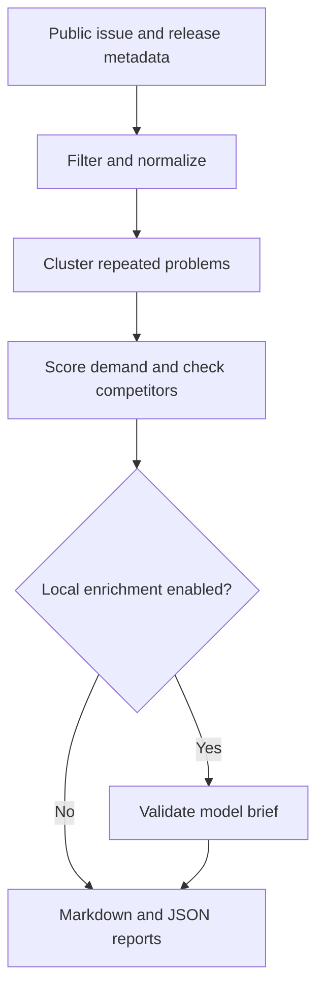

# BuildSignal AI

[](https://github.com/hanishkeloth/buildsignal-ai/actions/workflows/ci.yml)
[](https://www.python.org/)
[](LICENSE)

**Find useful AI developer projects to build, backed by inspectable GitHub evidence.**

BuildSignal watches public repositories, groups recurring developer problems, checks lexical
competition, and creates ranked project briefs with source links and every score component.
It is a Python CLI with **zero runtime dependencies**. An LLM is optional and only edits brief wording.

## Try it in a minute

```bash
git clone https://github.com/hanishkeloth/buildsignal-ai.git
cd buildsignal-ai
python3 -m venv .venv
source .venv/bin/activate
python -m pip install .
buildsignal demo --output demo-report
```

Requires Python 3.11+. Windows activation: `.venv\Scripts\activate`.
The offline demo produces three opportunities from **synthetic** issue fixtures, including a
tool-call parsing problem reported across two fictional repositories. No credentials or model required.

See the committed [example report](examples/buildsignal-2026-09-07.md) and
[JSON output](examples/buildsignal-2026-09-07.json).

## Scan real repositories

```bash
buildsignal init
buildsignal scan --config buildsignal.toml --output reports
buildsignal explain-score
```

Edit `buildsignal.toml` to choose your watchlist. Defaults include MCP, OpenAI Agents SDK,
Ollama, llama.cpp, vLLM, and MLX-LM. The scan uses GitHub's public REST API; no model endpoint is contacted.
For larger scans, set `GITHUB_TOKEN` in your shell using a minimally scoped token. Do not put it in
the configuration or commit it. Public requests work without a token, subject to lower rate limits.

Reports are `reports/buildsignal-YYYY-MM-DD.md` and `.json`. Repeated scans with the same date overwrite
that date's files; use separate output directories to keep multiple runs.

## How it works



1. Verify repository visibility on every scan. Private repositories are refused.
2. Fetch bounded pages of open issues and recent releases. Exclude PRs, drafts, closed issues,
   future-dated signals, and exact labels `security`, `private`, `spam`, `invalid`, `duplicate`,
   `wontfix`, and `wont-fix`.
3. Use title-weighted lexical similarity and union-find to cluster recurring requests.
4. Pre-rank clusters, then check up to twice the requested output count against repository search.
5. Keep source URLs, score components, competition results, warnings, and proposed validation steps.

| Component | Weight | Measurement |
| --- | ---: | --- |
| Demand | 28% | Logarithmic issue count, comments, reactions |
| Breadth | 18% | Number of distinct watched repositories |
| Recency | 18% | Exponential decay with a 30-day half-life |
| Evidence | 12% | Body detail, labels, engagement |
| Competition gap | 16% | Inverse logarithmic lexical search count |
| Release momentum | 8% | Related releases in the evidence window |

These weights are transparent heuristics, **not a calibrated market forecast**. Competitors can be
missed by lexical queries; a zero count never proves novelty. Competition failures get a neutral
50 component score and explicit warnings. A high score means investigate the linked problem.

## Optional local AI

Run a local server offering OpenAI-compatible `/v1/chat/completions`, then set:

```toml
[enrichment]
enabled = true
base_url = "http://127.0.0.1:11434/v1"
model = "your-installed-model"
allow_remote = false
api_key_env = ""
```

```bash
buildsignal scan --enrich
```

Only bounded titles, repository names, keywords, and evidence links go to the model. Issue bodies
are excluded. Valid JSON can change only `brief` and `enriched`; scores and evidence stay deterministic.
Failures keep the template brief. OpenAI-compatible does not guarantee support for JSON response mode:
choose a server/model that supports it. No particular model integration has been live-benchmarked.

Numeric loopback addresses are required by default. Remote endpoints require `allow_remote = true`
and HTTPS. Redirects and environment proxies are disabled for model requests. For authentication,
set `api_key_env` to the name of an environment variable, never the key itself.

## Reproducibility

```bash
buildsignal scan --config src/buildsignal/demo.toml \
  --fixture src/buildsignal/demo.json \
  --as-of 2026-09-07T00:00:00Z --output fixture-report
```

Fixture reports are clearly labeled synthetic. Matching inputs, configuration, and timestamps produce
matching results with model enrichment off. `--as-of` filters current API metadata: it does not recover
historical issue states. JSON reports omit issue bodies; raw response caches retain public bodies.

## Development

```bash
python -m pip install -e '.[dev]'
ruff check .
python -m unittest discover -s tests -v
python -m build
```

CI checks Python 3.11, 3.12, and 3.13, and executes the demo from an installed wheel outside the checkout.
Tests cover deterministic ranking, cross-repository clustering, pagination, ETag revalidation,
visibility changes, endpoint restrictions, invalid model outputs, safe rendering, and report stability.

## Limits and security

This is an alpha research aid. Clustering is O(n²) and lexical; keep watchlists focused. Pagination caps
can omit relevant issues. Exact exclusion labels are a filter, not sensitive-content detection.
Read public evidence critically, inspect competitors, and confirm demand before building.

GitHub content and model output are untrusted data. BuildSignal never clones or executes repository code,
never follows issue instructions, and never writes to GitHub. See [SECURITY.md](SECURITY.md).

## Research and ownership

See [research basis](docs/research-basis.md), [architecture](docs/architecture.md), and
[contribution guide](CONTRIBUTING.md). This implementation was reconstructed after an unpublished
prototype was lost; its behavior and tests are documented here rather than claiming identical history.

Created for and maintained by **Hanish Keloth**. Copyright 2026 Hanish Keloth.
Released under the [MIT License](LICENSE).
